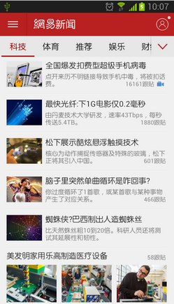
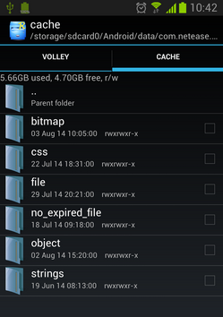
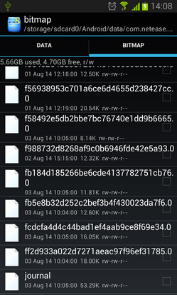
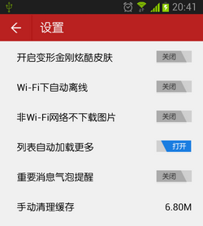
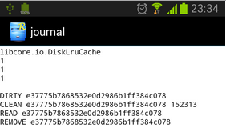
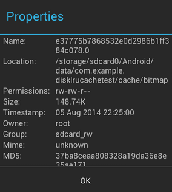

## DisklruCache 
LruCache在加载大图、多图时解决了内存泄露的问题，但是另外一个问题随之而来：图片从内存移除后，用户又要重新加载已经移除的图片时，只能从网络上重新加载一次，显然非常耗时，这是照片墙应用最常用的功能。Google又提供了一套硬盘缓存的解决方案：DiskLruCache(非Google官方编写，但获得官方认证)。只可惜，Android Doc中并没有对DiskLruCache的用法给出详细的说明，而网上关于DiskLruCache的资料也少之又少，因此今天我准备专门写一篇博客来详细讲解DiskLruCache的用法，以及分析它的工作原理，这应该也是目前网上关于DiskLruCache最详细的资料了。

 那么我们先来看一下有哪些应用程序已经使用了DiskLruCache技术。在我所接触的应用范围里，Dropbox、Twitter、网易新闻等都是使用DiskLruCache来进行硬盘缓存的，其中Dropbox和Twitter大多数人应该都没用过，那么我们就从大家最熟悉的网易新闻开始着手分析，来对DiskLruCache有一个最初的认识吧。

** 初探 **
 相信所有人都知道，网易新闻中的数据都是从网络上获取的，包括了很多的新闻内容和新闻图片，如下图所示：

 但是不知道大家有没有发现，这些内容和图片在从网络上获取到之后都会存入到本地缓存中，因此即使手机在没有网络的情况下依然能够加载出以前浏览过的新闻。而使用的缓存技术不用多说，自然是DiskLruCache了，那么首先第一个问题，这些数据都被缓存在了手机的什么位置呢？ 其实DiskLruCache并没有限制数据的缓存位置，可以自由地进行设定，但是通常情况下多数应用程序都会将缓存的位置选择为 /sdcard/Android/data/\<application package\>/cache 这个路径。选择在这个位置有两点好处：第一，这是存储在SD卡上的，因此即使缓存再多的数据也不会对手机的内置存储空间有任何影响，只要SD卡空间足够就行。第二，这个路径被Android系统认定为应用程序的缓存路径，当程序被卸载的时候，这里的数据也会一起被清除掉，这样就不会出现删除程序之后手机上还有很多残留数据的问题。 那么这里还是以网易新闻为例，它的客户端的包名是com.netease.newsreader.activity，因此数据缓存地址就应该是 /sdcard/Android/data/com.netease.newsreader.activity/cache ，我们进入到这个目录中看一下，结果如下图所示：

 可以看到有很多个文件夹，因为网易新闻对多种类型的数据都进行了缓存，这里简单起见我们只分析图片缓存就好，所以进入到bitmap文件夹当中。然后你将会看到一堆文件名很长的文件，这些文件命名没有任何规则，完全看不懂是什么意思，但如果你一直向下滚动，将会看到一个名为journal的文件，如下图所示：

那么这些文件到底都是什么呢？看到这里相信有些朋友已经是一头雾水了，这里我简单解释一下。上面那些文件名很长的文件就是一张张缓存的图片，每个文件都对应着一张图片，而journal文件是DiskLruCache的一个日志文件，程序对每张图片的操作记录都存放在这个文件中，基本上看到journal这个文件就标志着该程序使用DiskLruCache技术了。

** 下载 **
 好了，对DiskLruCache有了最初的认识之后，下面我们来学习一下DiskLruCache的用法吧。由于DiskLruCache并不是由Google官方编写的，所以这个类并没有被包含在Android API当中，我们需要将这个类从网上下载下来，然后手动添加到项目当中。DiskLruCache的源码在Github上托管，地址如下：
<https://github.com/JakeWharton/DiskLruCache>下载好了源码之后，只需要在项目中新建一个libcore.io包，然后将DiskLruCache.java文件复制到这个包中即可。

** 打开缓存 **
 这样的话我们就把准备工作做好了，下面看一下DiskLruCache到底该如何使用。首先你要知道，DiskLruCache是不能new出实例的，如果我们要创建一个DiskLruCache的实例，则需要调用它的open()方法，接口如下所示：

``` java
public static DiskLruCache open(File directory, int appVersion, int valueCount,long maxSize) ;
```

open()方法接收四个参数，第一个参数指定的是数据的缓存地址，第二个参数指定当前应用程序的版本号，第三个参数指定同一个key可以对应多少个缓存文件，基本都是传1，第四个参数指定最多可以缓存多少字节的数据。

 其中缓存地址前面已经说过了，通常都会存放在 /sdcard/Android/data/\<application package\>/cache 这个路径下面，但同时我们又需要考虑如果这个手机没有SD卡，或者SD正好被移除了的情况，因此比较优秀的程序都会专门写一个方法来获取缓存地址，如下所示：

``` java
public File getDiskCacheDir(Context context, String uniqueName){
    String cachePath;
    if (Environment.MEDIA_MOUNTED.equals(Environment.getExternalStorageState())

            || !Environment.isExternalStorageRemovable()) {
        cachePath = context.getExternalCacheDir().getPath();
    } else {
        cachePath = context.getCacheDir().getPath();
    }
    return new File(cachePath + File.separator + uniqueName);
}

```

 可以看到，当SD卡存在或者SD卡不可被移除的时候，就调用getExternalCacheDir()方法来获取缓存路径，否则就调用getCacheDir()方法来获取缓存路径。前者获取到的就是 /sdcard/Android/data/\<application package\>/cache 这个路径，而后者获取到的是 /data/data/\<application package\>/cache 这个路径。
接着又将获取到的路径和一个uniqueName进行拼接，作为最终的缓存路径返回。那么这个uniqueName又是什么呢？其实这就是为了对不同类型的数据进行区分而设定的一个唯一值，比如说在网易新闻缓存路径下看到的bitmap、object等文件夹。 接着是应用程序版本号，我们可以使用如下代码简单地获取到当前应用程序的版本号：

``` java
public int getAppVersion(Context context) {
    try {
        PackageInfo info = context.getPackageManager().getPackageInfo(context.getPackageName(), 0);
        return info.versionCode;
    } catch (NameNotFoundException e) {
        e.printStackTrace();
    }
    return 1;
}

```

 需要注意的是，每当版本号改变，缓存路径下存储的所有数据都会被清除掉，因为DiskLruCache认为当应用程序有版本更新的时候，所有的数据都应该从网上重新获取。
后面两个参数就没什么需要解释的了，第三个参数传1，第四个参数通常传入10M的大小就够了，这个可以根据自身的情况进行调节。 因此，一个非常标准的open()方法就可以这样写：

``` java
DiskLruCache mDiskLruCache = null;
try {
    File cacheDir = getDiskCacheDir(context, "bitmap");
    if (!cacheDir.exists()) {
        cacheDir.mkdirs();
    }
    mDiskLruCache = DiskLruCache.open(cacheDir, getAppVersion(context), 1, 10 *1024 * 1024);
} catch (IOException e) {
    e.printStackTrace();
}```


 首先调用getDiskCacheDir()方法获取到缓存地址的路径，然后判断一下该路径是否存在，如果不存在就创建一下。接着调用DiskLruCache的open()方法来创建实例，并把四个参数传入即可。
有了DiskLruCache的实例之后，我们就可以对缓存的数据进行操作了，操作类型主要包括写入、访问、移除等，我们一个个进行学习。

 **写入缓存**
 先来看写入，比如说现在有一张图片，地址是[http://img.my.csdn.net/uploads/201309/01/1378037235\_7476.jpg](http://img.my.csdn.net/uploads/201309/01/1378037235_7476.jpg)，那么为了将这张图片下载下来，就可以这样写：

``` java
private boolean downloadUrlToStream(String urlString, OutputStream outputStream) {
    HttpURLConnection urlConnection = null;
    BufferedOutputStream out = null;
    BufferedInputStream in = null;
    try {
        final URL url = new URL(urlString);
        urlConnection = (HttpURLConnection) url.openConnection();
        in = new BufferedInputStream(urlConnection.getInputStream(), 8 * 1024);
        out = new BufferedOutputStream(outputStream, 8 * 1024);
        int b;
        while ((b = in.read()) != -1) {
            out.write(b);
        }
        return true;
    } catch (final IOException e) {
        e.printStackTrace();
    } finally {
        if (urlConnection != null) {
            urlConnection.disconnect();
        }
        try {
            if (out != null) {
                out.close();
            }
            if (in != null) {
                in.close();
            }
        } catch (final IOException e) {
            e.printStackTrace();
        }
    }
    return false;
}

```

 这段代码相当基础，相信大家都看得懂，就是访问urlString中传入的网址，并通过outputStream写入到本地。有了这个方法之后，下面我们就可以使用DiskLruCache来进行写入了，写入的操作是借助DiskLruCache.Editor这个类完成的。类似地，这个类也是不能new的，需要调用DiskLruCache的edit()方法来获取实例，接口如下所示：

```java
public Editor edit(String key) throws IOException
``

可以看到，edit()方法接收一个参数key，这个key将会成为缓存文件的文件名，并且必须要和图片的URL是一一对应的。那么怎样才能让key和图片的URL能够一一对应呢？直接使用URL来作为key？不太合适，因为图片URL中可能包含一些特殊字符，这些字符有可能在命名文件时是不合法的。其实最简单的做法就是将图片的URL进行MD5编码，编码后的字符串肯定是唯一的，并且只会包含0-F这样的字符，完全符合文件的命名规则。
那么我们就写一个方法用来将字符串进行MD5编码，代码如下所示：
```java
public String hashKeyForDisk(String key) {
    String cacheKey;
    try {
        final MessageDigest mDigest = MessageDigest.getInstance("MD5");
        mDigest.update(key.getBytes());
        cacheKey = bytesToHexString(mDigest.digest());
    } catch (NoSuchAlgorithmException e) {
        cacheKey = String.valueOf(key.hashCode());
    }

    return cacheKey;
}

private String bytesToHexString(byte[] bytes) {
    StringBuilder sb = new StringBuilder();
    for (int i = 0; i < bytes.length; i++) {
        String hex = Integer.toHexString(0xFF & bytes[i]);
        if (hex.length() == 1) {
            sb.append('0');
        }
        sb.append(hex);
    }
    return sb.toString();
}
```

代码很简单，现在我们只需要调用一下hashKeyForDisk()方法，并把图片的URL传入到这个方法中，就可以得到对应的key了。
因此，现在就可以这样写来得到一个DiskLruCache.Editor的实例：

``` java
String imageUrl = "http://img.my.csdn.net/uploads/201309/01/1378037235_7476.jpg";
String key = hashKeyForDisk(imageUrl);
DiskLruCache.Editor editor = mDiskLruCache.edit(key);
```

有了DiskLruCache.Editor的实例之后，我们可以调用它的newOutputStream()方法来创建一个输出流，然后把它传入到downloadUrlToStream()中就能实现下载并写入缓存的功能了。注意newOutputStream()方法接收一个index参数，由于前面在设置valueCount的时候指定的是1，所以这里index传0就可以了。在写入操作执行完之后，我们还需要调用一下commit()方法进行提交才能使写入生效，调用abort()方法的话则表示放弃此次写入。
因此，一次完整写入操作的代码如下所示：
``` java
new Thread(new Runnable() {
    @Override
    public void run() {
        try {
            String imageUrl ="http://img.my.csdn.net/uploads/201309/01/1378037235_7476.jpg";
            String key = hashKeyForDisk(imageUrl);
            DiskLruCache.Editor editor = mDiskLruCache.edit(key);
            if (editor != null) {
                OutputStream outputStream = editor.newOutputStream(0);
                if (downloadUrlToStream(imageUrl, outputStream)) {
                    editor.commit();
                } else {
                    editor.abort();
                }
            }
            mDiskLruCache.flush();
        } catch (IOException e) {
            e.printStackTrace();
        }
    }
}).start();

```

由于这里调用了downloadUrlToStream()方法来从网络上下载图片，所以一定要确保这段代码是在子线程当中执行的。注意在代码的最后我还调用了一下flush()方法，这个方法并不是每次写入都必须要调用的，但在这里却不可缺少，我会在后面说明它的作用。
现在的话缓存应该是已经成功写入了，我们进入到SD卡上的缓存目录里看一下，如下图所示：

 可以看到，这里有一个文件名很长的文件，和一个journal文件，那个文件名很长的文件自然就是缓存的图片了，因为是使用了MD5编码来进行命名的。

**读取缓存 **
 缓存已经写入成功之后，接下来我们就该学习一下如何读取了。读取的方法要比写入简单一些，主要是借助DiskLruCache的get()方法实现的，接口如下所示：

```java
public synchronized Snapshot get(String key) throws IOException
```

很明显，get()方法要求传入一个key来获取到相应的缓存数据，而这个key毫无疑问就是将图片URL进行MD5编码后的值了，因此读取缓存数据的代码就可以这样写：

``` java
String imageUrl = "http://img.my.csdn.net/uploads/201309/01/1378037235_7476.jpg";
String key = hashKeyForDisk(imageUrl);
DiskLruCache.Snapshot snapShot = mDiskLruCache.get(key);
```

 很奇怪的是，这里获取到的是一个DiskLruCache.Snapshot对象，这个对象我们该怎么利用呢？很简单，只需要调用它的getInputStream()方法就可以得到缓存文件的输入流了。同样地，getInputStream()方法也需要传一个index参数，这里传入0就好。有了文件的输入流之后，想要把缓存图片显示到界面上就轻而易举了。所以，一段完整的读取缓存，并将图片加载到界面上的代码如下所示：

```java
try {
    String imageUrl ="http://img.my.csdn.net/uploads/201309/01/1378037235_7476.jpg";
    String key = hashKeyForDisk(imageUrl);
    DiskLruCache.Snapshot snapShot = mDiskLruCache.get(key);
    if (snapShot != null) {
        InputStream is = snapShot.getInputStream(0);
        Bitmap bitmap = BitmapFactory.decodeStream(is);
        mImage.setImageBitmap(bitmap);
    }
} catch (IOException e) {
    e.printStackTrace();
}
```

 我们使用了BitmapFactory的decodeStream()方法将文件流解析成Bitmap对象，然后把它设置到ImageView当中。如果运行一下程序，将会看到如下效果：

 OK，图片已经成功显示出来了。注意这是我们从本地缓存中加载的，而不是从网络上加载的，因此即使在你手机没有联网的情况下，这张图片仍然可以显示出来。

** 移除缓存 **
 学习完了写入缓存和读取缓存的方法之后，最难的两个操作你就都已经掌握了，那么接下来要学习的移除缓存对你来说也一定非常轻松了。移除缓存主要是借助DiskLruCache的remove()方法实现的，接口如下所示：

```java
public synchronized boolean remove(String key) throws IOException
```

相信你已经相当熟悉了，remove()方法中要求传入一个key，然后会删除这个key对应的缓存图片，示例代码如下：
```java
try {
    String imageUrl ="http://img.my.csdn.net/uploads/201309/01/1378037235_7476.jpg";
    String key = hashKeyForDisk(imageUrl);
    mDiskLruCache.remove(key);
} catch (IOException e) {
    e.printStackTrace();
}
```

 用法虽然简单，但是你要知道，这个方法我们并不应该经常去调用它。因为你完全不需要担心缓存的数据过多从而占用SD卡太多空间的问题，DiskLruCache会根据我们在调用open()方法时设定的缓存最大值来自动删除多余的缓存。只有你确定某个key对应的缓存内容已经过期，需要从网络获取最新数据的时候才应该调用remove()方法来移除缓存。

** **

** 其它API **
 除了写入缓存、读取缓存、移除缓存之外，DiskLruCache还提供了另外一些比较常用的API，我们简单学习一下。 1\. size() 这个方法会返回当前缓存路径下所有缓存数据的总字节数，以byte为单位，如果应用程序中需要在界面上显示当前缓存数据的总大小，就可以通过调用这个方法计算出来。比如网易新闻中就有这样一个功能，如下图所示：


 这个方法用于将内存中的操作记录同步到日志文件（也就是journal文件）当中。这个方法非常重要，因为DiskLruCache能够正常工作的前提就是要依赖于journal文件中的内容。前面在讲解写入缓存操作的时候我有调用过一次这个方法，但其实并不是每次写入缓存都要调用一次flush()方法的，频繁地调用并不会带来任何好处，只会额外增加同步journal文件的时间。比较标准的做法就是在Activity的onPause()方法中去调用一次flush()方法就可以了。 3.close() 这个方法用于将DiskLruCache关闭掉，是和open()方法对应的一个方法。关闭掉了之后就不能再调用DiskLruCache中任何操作缓存数据的方法，通常只应该在Activity的onDestroy()方法中去调用close()方法。

4.delete()

这个方法用于将所有的缓存数据全部删除，比如说网易新闻中的那个手动清理缓存功能，其实只需要调用一下DiskLruCache的delete()方法就可以实现了。

解读journal
前面已经提到过，DiskLruCache能够正常工作的前提就是要依赖于journal文件中的内容，因此，能够读懂journal文件对于我们理解DiskLruCache的工作原理有着非常重要的作用。那么journal文件中的内容到底是什么样的呢？我们来打开瞧一瞧吧，如下图所示：  


由于现在只缓存了一张图片，所以journal中并没有几行日志，我们一行行进行分析。第一行是个固定的字符串“libcore.io.DiskLruCache”，标志着我们使用的是DiskLruCache技术。第二行是DiskLruCache的版本号，这个值是恒为1的。第三行是应用程序的版本号，我们在open()方法里传入的版本号是什么这里就会显示什么。第四行是valueCount，这个值也是在open()方法中传入的，通常情况下都为1。第五行是一个空行。前五行也被称为journal文件的头，这部分内容还是比较好理解的，但是接下来的部分就要稍微动点脑筋了。

第六行是以一个DIRTY前缀开始的，后面紧跟着缓存图片的key。通常我们看到DIRTY这个字样都不代表着什么好事情，意味着这是一条脏数据。没错，每当我们调用一次DiskLruCache的edit()方法时，都会向journal文件中写入一条DIRTY记录，表示我们正准备写入一条缓存数据，但不知结果如何。然后调用commit()方法表示写入缓存成功，这时会向journal中写入一条CLEAN记录，意味着这条“脏”数据被“洗干净了”，调用abort()方法表示写入缓存失败，这时会向journal中写入一条REMOVE记录。也就是说，每一行DIRTY的key，后面都应该有一行对应的CLEAN或者REMOVE的记录，否则这条数据就是“脏”的，会被自动删除掉。

如果你足够细心的话应该还会注意到，第七行的那条记录，除了CLEAN前缀和key之外，后面还有一个152313，这是什么意思呢？其实，DiskLruCache会在每一行CLEAN记录的最后加上该条缓存数据的大小，以字节为单位。152313也就是我们缓存的那张图片的字节数了，换算出来大概是148.74K，和缓存图片刚刚好一样大，如下图所示：


前面我们所学的size()方法可以获取到当前缓存路径下所有缓存数据的总字节数，其实它的工作原理就是把journal文件中所有CLEAN记录的字节数相加，求出的总合再把它返回而已。

除了DIRTY、CLEAN、REMOVE之外，还有一种前缀是READ的记录，这个就非常简单了，每当我们调用get()方法去读取一条缓存数据时，就会向journal文件中写入一条READ记录。因此，像网易新闻这种图片和数据量都非常大的程序，journal文件中就可能会有大量的READ记录。

那么你可能会担心了，如果我不停频繁操作的话，就会不断地向journal文件中写入数据，那这样journal文件岂不是会越来越大？这倒不必担心，DiskLruCache中使用了一个redundantOpCount变量来记录用户操作的次数，每执行一次写入、读取或移除缓存的操作，这个变量值都会加1，当变量值达到2000的时候就会触发重构journal的事件，这时会自动把journal中一些多余的、不必要的记录全部清除掉，保证journal文件的大小始终保持在一个合理的范围内。
